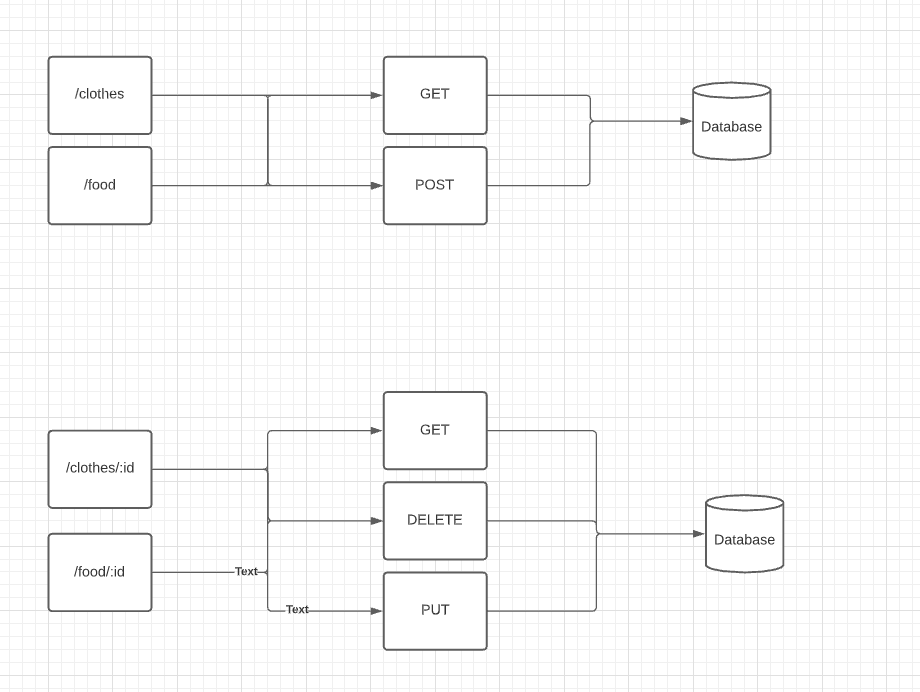

# LAB - Class 02

## Project: basic-express-server

### Author: Omar Ramadan (ramomar1992)

### Links and Resources

- [test results](https://github.com/401-repos/basic-express-server/actions)
- [back-end server url](https://basic-server-1.herokuapp.com/)

### Setup

#### `.env` requirements

- `PORT` - Port Number

#### How to initialize/run your application

- `npm install`

- `npm start`

#### Tests

- `npm test`

#### UML

